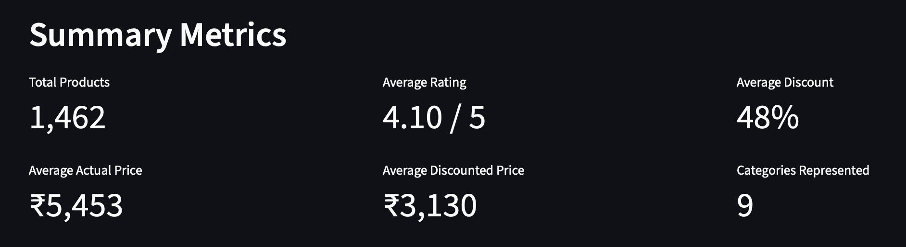

# Amazon Sales Dashboard



A Streamlit dashboard exploring the [Amazon Sales Dataset (Kaggle)](https://www.kaggle.com/datasets/karkavelrajaj/amazon-sales-dataset) — product categories, prices, discounts, and ratings. After cleaning, the dataset covers 1,462 products across 9 categories.

## Setup

```bash
uv add pandas streamlit plotly
```

Download `amazon.csv` from the Kaggle link above (requires a free Kaggle account) and place it at `data/raw/amazon.csv`.

## Run

```bash
uv run streamlit run app.py
```

Then open the local URL Streamlit prints (usually http://localhost:8501).

## Data Cleaning Decisions

The raw CSV has several fields that don't load as usable numbers by default:

- **`discounted_price` / `actual_price`** — stored as text with a `₹` symbol and comma thousands separators (e.g. `"₹1,099"`). Stripped the `₹` and commas, then converted to float.
- **`discount_percentage`** — stored as a string like `"64%"`. Stripped the `%` sign and converted to float.
- **`rating`** — mostly numeric strings, but at least one row contains a non-numeric placeholder (`"|"`) that breaks a direct `float()` conversion. Used `pd.to_numeric(..., errors="coerce")` so bad values become `NaN` instead of crashing the app, then dropped rows with a missing rating.
- **`rating_count`** — stored with comma separators (e.g. `"24,269"`) and has some missing values. Stripped commas, converted to numeric, and dropped rows still missing after that.

Rows still missing `discounted_price`, `actual_price`, `rating`, or `rating_count` after cleaning are dropped, since those four fields are needed for the metrics and charts. This drops the dataset from 1,465 to 1,462 rows.

A `main_category` column was created by taking the first segment of the `|`-separated `category` field (e.g. `"Computers&Accessories|Accessories&Peripherals|..."` → `"Computers&Accessories"`), since the full category path is too granular to chart cleanly.

## Key Findings

- Electronics-related categories dominate the marketplace, making up the largest share of listings among all 9 categories.
- Products carry a steep average discount (~48% off list price).
- No meaningful relationship between price and rating — cheap and expensive products rate about the same.

## Dashboard Contents

- Dataset preview (first 10 rows after cleaning)
- 6 summary metrics: total products, average rating, average discount, average actual price, average discounted price, number of categories
- 4 charts with written takeaways:
  1. Products per category
  2. Average rating by category
  3. Actual vs. discounted price for the most-discounted products
  4. Rating vs. discounted price

## Files

- `app.py` — the Streamlit dashboard
- `data/raw/amazon.csv` — the dataset (download separately, see Setup)
- `screenshots/` — dashboard screenshots
